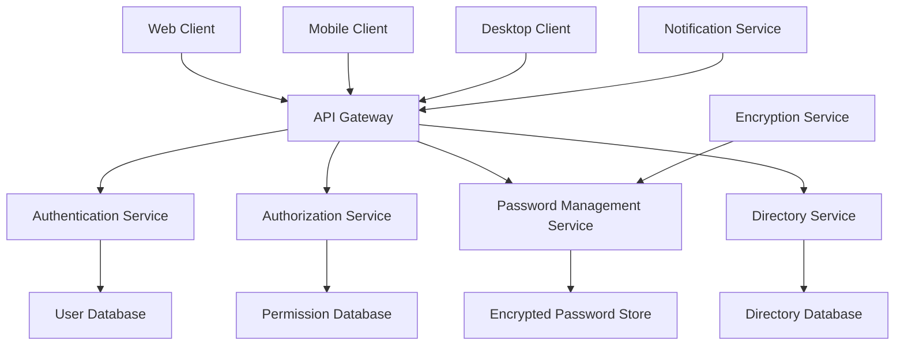
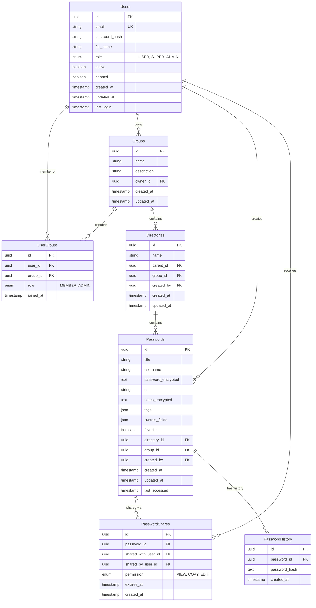
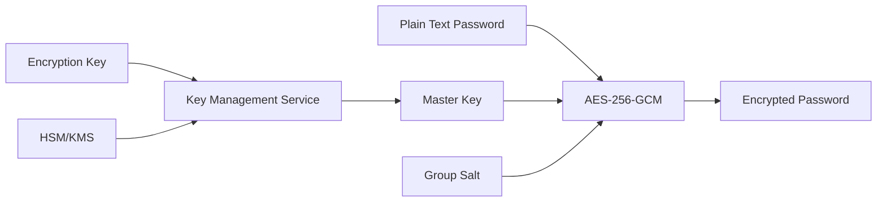
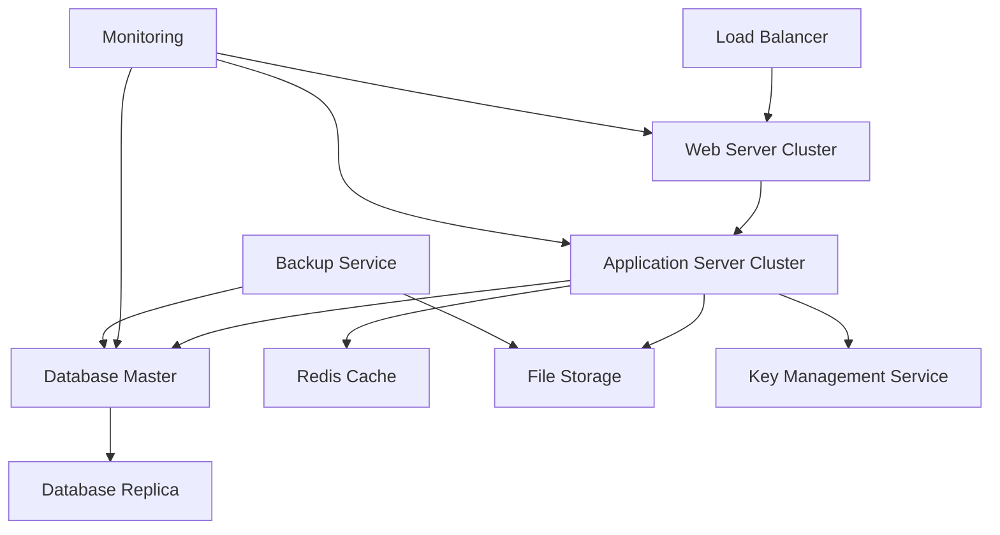

# Enterprise Password Management System
## Software Requirements Specification (SRS)

**Version**: 1.0  
**Date**: September 2025  
**Document Type**: Technical Specification  

> **📋 Related Documents:**
> - **Product Planning**: [PRD.md](docs/PRD.md) - Product requirements and user stories
> - **Technical Implementation**: [ARCHITECTURE.md](docs/ARCHITECTURE.md) - Software architecture and design
> - **Development Tasks**: [BACKLOG.md](docs/BACKLOG.md) - Sprint planning and progress tracking
> - **Developer Resources**: [DEVELOPER_GUIDE.md](docs/DEVELOPER_GUIDE.md) - Setup and onboarding guide
> - **Code Standards**: [CODING_STANDARDS.md](docs/CODING_STANDARDS.md) - Development best practices

---

## 1. Introduction

### 1.1 Purpose
Dokumen ini menjabarkan spesifikasi perangkat lunak untuk sistem manajemen password enterprise yang aman, scalable, dan mudah digunakan untuk organisasi dengan struktur hierarkis.

### 1.2 Background & Business Need
Di era digital saat ini, organisasi menghadapi tantangan security yang semakin kompleks. Sebuah penelitian dari Verizon Data Breach Investigations Report menunjukkan bahwa 81% data breach melibatkan credential yang weak atau stolen. Sementara itu, karyawan rata-rata mengelola lebih dari 191 password untuk berbagai aplikasi bisnis.

**Permasalahan Utama:**
- **Password Reuse**: 65% karyawan menggunakan password yang sama di multiple platform
- **Weak Passwords**: Hanya 12% organisasi yang enforce strong password policy secara konsisten  
- **Shadow IT**: Tim sering sharing password melalui channel tidak aman (email, chat, spreadsheet)
- **Compliance Gap**: Kesulitan tracking untuk akses credential dalam regulatory requirements
- **Scalability Issues**: Manajemen access control yang manual saat organisasi berkembang

**Impact Bisnis:**
Tanpa centralized password management, organisasi menghadapi risiko:
- **Financial Loss**: Average cost of data breach mencapai $4.45 juta (IBM Security Report)
- **Operational Disruption**: Downtime sistem akibat compromised credentials
- **Compliance Penalty**: Denda regulasi seperti GDPR hingga 4% annual revenue
- **Reputation Damage**: Loss of customer trust dan brand value

**Solusi yang Dibutuhkan:**
Enterprise password manager dengan privacy-first approach yang memungkinkan:
- Secure sharing tanpa compromising individual privacy
- Centralized governance dengan decentralized control
- Zero-trust architecture yang melindungi dari insider threats
- Seamless collaboration dengan full transparency

### 1.2 Scope
Sistem ini dirancang untuk organisasi yang membutuhkan:
- Manajemen password terpusat dengan akses berbasis grup
- Kontrol akses berlapis dengan role-based permissions
- Enkripsi end-to-end untuk data sensitif
- Interface yang user-friendly untuk berbagai perangkat

### 1.3 Target Users
- **End Users**: Karyawan yang membutuhkan akses password
- **Group Admins**: Manager yang mengelola akses tim
- **Super Admins**: IT administrator untuk manajemen sistem dan oversight

---

## 2. System Overview

> **🏗️ Implementation Details**: For detailed technical architecture, database design, and code examples, see [ARCHITECTURE.md](docs/ARCHITECTURE.md)

### 2.1 Architecture Principles
- **Security First**: Enkripsi AES-256 untuk data sensitif
- **Zero-Trust**: Verifikasi identitas di setiap akses
- **Modular Design**: Component-based untuk maintainability
- **Platform Agnostic**: Dapat diimplementasi dengan berbagai stack
- **Scalable**: Mendukung pertumbuhan organisasi

### 2.2 Core Components


---

## 3. Functional Requirements

> **📝 User Stories**: For detailed user stories, acceptance criteria, and development tasks, see [PRD.md](docs/PRD.md) and [BACKLOG.md](docs/BACKLOG.md)

### 3.1 Authentication & Authorization

#### 3.1.1 User Authentication
**FR-AUTH-001**: Sistem harus mendukung multiple authentication methods
- Email/password dengan password hashing (bcrypt/scrypt)
- Single Sign-On (SSO) dengan SAML 2.0 atau OAuth 2.0
- Multi-Factor Authentication (MFA) dengan TOTP/SMS
- Session management dengan secure tokens

**FR-AUTH-002**: Password Policy
- Minimum 8 karakter dengan complexity requirements
- Password history (tidak boleh sama dengan 5 password terakhir)
- Password expiration policy yang configurable
- Account lockout setelah failed attempts

#### 3.1.2 Role-Based Access Control
**FR-RBAC-001**: Sistem harus implementasi role-based access dengan privacy-first approach:

**User Roles:**
- **USER**: Role default untuk semua registered user
- **SUPER_ADMIN**: System administrator dengan limited privileges

**Group-Level Permissions:**
- **GROUP_OWNER**: Creator dari group, full control atas group
- **GROUP_ADMIN**: Assigned admin yang bisa manage member
- **GROUP_MEMBER**: Member biasa dengan akses read/write

**FR-RBAC-002**: Group Ownership & Management
- Setiap user dapat create unlimited groups dan otomatis menjadi GROUP_OWNER
- GROUP_OWNER dapat:
  - Add/remove members dari group
  - Assign/revoke GROUP_ADMIN role ke member lain
  - Delete group (dengan konfirmasi)
  - Manage semua directories dan passwords dalam group
- GROUP_ADMIN dapat:
  - Add/remove GROUP_MEMBER (tidak bisa remove owner atau admin lain)
  - Manage directories dan passwords dalam group

**FR-RBAC-003**: Privacy & Access Control
- **Zero-Trust Principle**: Tidak ada user yang dapat akses data user/group lain tanpa explicit permission
- **Super Admin Limitations**: SUPER_ADMIN hanya dapat:
  - Ban/unban user accounts
  - View system-level statistics (anonymized)
  - Manage system settings
  - **TIDAK DAPAT** melihat password atau data sensitif user lain
- **Data Isolation**: Setiap group memiliki isolation penuh dari group lain

**FR-RBAC-004**: Member Permissions dalam Group
- GROUP_MEMBER dapat:
  - View semua directories dalam group
  - Create/read/update/delete passwords dalam group
  - Create directories dalam group
  - Mark passwords sebagai favorite
- Permission berlaku untuk semua directories dalam group (flat permission model)

### 3.2 Directory & Group Management

**FR-DIR-001**: Group-Based Directory Structure
- Directories hanya dapat dibuat dalam context group
- Maximum 2 level directory (Parent → Child) per group
- Semua member group dapat create/read/update/delete directories
- Directory permission: semua member group punya full access

**FR-DIR-002**: Group Management
- Setiap user dapat create unlimited groups
- Group creator otomatis menjadi GROUP_OWNER
- GROUP_OWNER dapat assign GROUP_ADMIN ke member lain
- GROUP_ADMIN dapat manage member (add/remove GROUP_MEMBER only)
- Tidak ada nested group atau group inheritance

### 3.3 Password Management

#### 3.3.1 Password Storage
**FR-PWD-001**: Secure Password Storage
- AES-256-GCM encryption untuk password dan sensitive fields
- Separate encryption key per group
- Key rotation capability
- Encrypted backup dan recovery

**FR-PWD-002**: Password Entry Structure
```json
{
  "id": "string",
  "title": "string",
  "username": "string",
  "password": "encrypted_string",
  "url": "string",
  "notes": "encrypted_string",
  "tags": ["string"],
  "custom_fields": [
    {
      "name": "string",
      "value": "encrypted_string",
      "type": "text|password|url|email"
    }
  ],
  "favorite": "boolean",
  "directory_id": "string",
  "created_at": "timestamp",
  "updated_at": "timestamp",
  "created_by": "string",
  "last_accessed": "timestamp"
}
```

#### 3.3.2 Password Operations
**FR-PWD-003**: CRUD Operations
- Create password dengan validation
- Read dengan decryption on-demand
- Update dengan version history
- Delete dengan soft-delete untuk recovery

**FR-PWD-004**: Password Generation
- Configurable length (8-128 characters)
- Character set selection (uppercase, lowercase, numbers, symbols)
- Exclude ambiguous characters option
- Generate secure passphrase option
- Password strength meter dengan scoring

#### 3.3.3 Search & Organization
**FR-PWD-005**: Advanced Search
- Full-text search dalam title, username, URL, tags
- Filter berdasarkan: directory, tags, date range, created_by
- Sort berdasarkan: name, last_accessed, created_at, favorite
- Search within results capability

**FR-PWD-006**: Favorites System
- Mark/unmark password sebagai favorite
- Favorites quick access panel
- Bulk favorite operations
- Favorite-first sorting option

### 3.4 Sharing & Collaboration

**FR-SHARE-001**: Password Sharing
- Share password ke specific users atau groups
- Permission levels: VIEW, COPY, EDIT
- Time-limited sharing dengan expiration
- Share notification dan tracking

**FR-SHARE-002**: Sharing Workflow
- Request access workflow untuk sensitive passwords
- Approval notification untuk group admins
- Automatic revocation pada role change
- Emergency access procedures

### 3.5 Security & Monitoring

**FR-SEC-001**: Security Monitoring
- Failed login attempt monitoring
- Unusual access pattern detection
- Password breach checking (integration dengan HaveIBeenPwned)
- Security alert notifications

**FR-SEC-002**: Data Protection
- Data encryption at rest dan in transit
- Secure key management dengan hardware security modules
- Regular security scans dan vulnerability assessments
- GDPR compliance untuk data handling

---

## 4. Non-Functional Requirements

### 4.1 Performance
- **Response Time**: API response < 200ms untuk 95% requests
- **Throughput**: Handle 1000 concurrent users
- **Database**: Support 1M+ password entries
- **Scalability**: Horizontal scaling capability

### 4.2 Security
- **Encryption**: AES-256-GCM untuk data at rest
- **Transport**: TLS 1.3 untuk data in transit  
- **Authentication**: Session timeout setelah 8 jam inactivity
- **Compliance**: SOC 2 Type II, ISO 27001 ready

### 4.3 Availability
- **Uptime**: 99.9% availability (8.77 hours downtime/year)
- **Backup**: Daily automated backup dengan 30-day retention
- **Recovery**: RTO < 4 hours, RPO < 1 hour
- **Monitoring**: Real-time health checks dan alerting

### 4.4 Usability
- **Interface**: Responsive design untuk desktop, tablet, mobile
- **Accessibility**: WCAG 2.1 AA compliance
- **Languages**: Multi-language support (i18n ready)
- **Browser**: Support Chrome, Firefox, Safari, Edge (latest 2 versions)

---

## 5. User Interface Specifications

### 5.1 Design System

#### 5.1.1 Color Palette
```css
:root {
  /* Primary Colors */
  --primary-50: #f0f9ff;
  --primary-500: #3b82f6;
  --primary-600: #2563eb;
  --primary-900: #1e3a8a;

  /* Semantic Colors */
  --success: #10b981;
  --warning: #f59e0b;
  --error: #ef4444;
  --info: #06b6d4;

  /* Neutral Colors */
  --gray-50: #f9fafb;
  --gray-100: #f3f4f6;
  --gray-500: #6b7280;
  --gray-900: #111827;
}
```

#### 5.1.2 Typography
- **Primary Font**: System font stack untuk optimal performance
- **Heading**: Bold weights untuk hierarchy
- **Body**: Regular weight, 16px base size
- **Code**: Monospace untuk passwords dan technical data

#### 5.1.3 Spacing & Layout
- **Base Unit**: 4px grid system
- **Container**: Max-width 1200px dengan responsive breakpoints
- **Component Spacing**: 8px, 16px, 24px, 32px multiples
- **Border Radius**: 4px untuk components, 8px untuk cards

### 5.2 Component Specifications

#### 5.2.1 Navigation
**Primary Navigation**
- Collapsible sidebar untuk desktop
- Bottom navigation untuk mobile
- Breadcrumb untuk hierarchical navigation
- Search bar dengan autocomplete

**Navigation States**
```
Active: Primary color background
Hover: Light background tint
Focus: Outline ring untuk keyboard navigation
Disabled: Reduced opacity dengan no-pointer
```

#### 5.2.2 Forms
**Input Components**
- Text inputs dengan proper validation states
- Password inputs dengan show/hide toggle
- Dropdown selects dengan search capability
- Multi-select dengan tag display

**Form Validation**
- Real-time validation feedback
- Error messages yang actionable
- Success states untuk completed actions
- Loading states untuk async operations

#### 5.2.3 Data Display
**Password List**
- Card-based layout dengan hover states
- Quick action buttons (copy, edit, favorite)
- Tag display dengan color coding
- Last accessed timestamp

**Password Detail Modal**
```
┌─────────────────────────────────┐
│ [×] Password Details            │
├─────────────────────────────────┤
│ Title: [Corporate Email]        │
│ Username: [john@company.com]    │
│ Password: [••••••••] [👁] [📋]   │
│ URL: [https://mail.company.com] │
│ Notes: [Encrypted notes...]     │
│ Tags: [email] [corporate]       │
├─────────────────────────────────┤
│ [Edit] [Delete] [Share]         │
└─────────────────────────────────┘
```

### 5.3 Responsive Breakpoints
```css
/* Mobile First Approach */
@media (min-width: 640px) { /* sm */ }
@media (min-width: 768px) { /* md */ }
@media (min-width: 1024px) { /* lg */ }
@media (min-width: 1280px) { /* xl */ }
```

---

## 6. API Specifications

> **🔧 Implementation Guide**: For Django models, views, services, and detailed code examples, see [ARCHITECTURE.md](docs/ARCHITECTURE.md)

### 6.1 RESTful API Design

#### 6.1.1 Base URL Structure
```
https://api.passwordmanager.com/v1
```

#### 6.1.2 Authentication
```http
Authorization: Bearer <JWT_TOKEN>
Content-Type: application/json
X-API-Version: 1.0
```

#### 6.1.3 Core Endpoints

**Authentication**
```http
POST /auth/login
POST /auth/logout
POST /auth/refresh
GET  /auth/me
POST /auth/forgot-password
POST /auth/reset-password
```

**User Management** (Super Admin only)
```http
GET    /admin/users               # Get all users (basic info only)
PUT    /admin/users/{id}/ban      # Ban user account
PUT    /admin/users/{id}/unban    # Unban user account
GET    /admin/stats               # Get anonymized system statistics
```

**Personal User Management**
```http
GET    /users/me                  # Get own profile
PUT    /users/me                  # Update own profile
DELETE /users/me                  # Delete own account
GET    /users/me/groups           # Get groups where user is member
```

**Group Management**
```http
GET    /groups                    # Get groups where user is member/owner/admin
POST   /groups                    # Create new group (user becomes owner)
GET    /groups/{id}               # Get group details (if member/owner/admin)
PUT    /groups/{id}               # Update group (owner/admin only)
DELETE /groups/{id}               # Delete group (owner only)
GET    /groups/{id}/members       # Get group members (member/owner/admin)
POST   /groups/{id}/members       # Add member (owner/admin only)
DELETE /groups/{id}/members/{userId} # Remove member (owner/admin only)
PUT    /groups/{id}/members/{userId}/role # Change member role (owner only)
```

**Directory Management**
```http
GET    /groups/{groupId}/directories
POST   /groups/{groupId}/directories
GET    /groups/{groupId}/directories/{id}
PUT    /groups/{groupId}/directories/{id}
DELETE /groups/{groupId}/directories/{id}
GET    /groups/{groupId}/directories/{id}/passwords
```

**Password Management**
```http
GET    /groups/{groupId}/passwords
POST   /groups/{groupId}/passwords
GET    /groups/{groupId}/passwords/{id}
PUT    /groups/{groupId}/passwords/{id}
DELETE /groups/{groupId}/passwords/{id}
POST   /groups/{groupId}/passwords/{id}/share
GET    /groups/{groupId}/passwords/{id}/shares
PUT    /groups/{groupId}/passwords/{id}/shares/{shareId}
DELETE /groups/{groupId}/passwords/{id}/shares/{shareId}
GET    /groups/{groupId}/passwords/search?q={query}&filter={filter}
POST   /groups/{groupId}/passwords/generate
PUT    /groups/{groupId}/passwords/{id}/favorite
GET    /groups/{groupId}/passwords/{id}/history
```

#### 6.1.4 Response Format
```json
{
  "success": true,
  "data": {
    // Response data
  },
  "meta": {
    "timestamp": "2024-01-01T00:00:00Z",
    "version": "1.0",
    "pagination": {
      "page": 1,
      "limit": 20,
      "total": 100,
      "pages": 5
    }
  },
  "errors": [
    {
      "code": "VALIDATION_ERROR",
      "message": "Invalid input data",
      "field": "email"
    }
  ]
}
```

### 6.2 WebSocket Events
```javascript
// Real-time notifications
{
  "type": "password_shared",
  "data": {
    "password_id": "uuid",
    "shared_by": "user_id",
    "permission": "view"
  }
}

// Security alerts
{
  "type": "security_alert",
  "data": {
    "type": "unusual_access",
    "details": "Login from new location"
  }
}
```

---

## 7. Database Schema

> **💾 Django Models**: For complete Django model implementations, relationships, and database optimization, see [ARCHITECTURE.md](docs/ARCHITECTURE.md)

### 7.1 Entity Relationship Diagram


### 7.2 Key Database Constraints
- **Unique Constraints**: User email, group name per deployment
- **Foreign Keys**: Cascade delete untuk related records
- **Indexes**: Composite indexes pada frequently queried columns
- **Data Types**: UUID untuk primary keys, TEXT untuk encrypted fields

---

## 8. Security Architecture

### 8.1 Encryption Strategy


### 8.2 Key Management
- **Master Key**: Derived dari group-specific data
- **Encryption Keys**: Rotated setiap 90 hari
- **Key Storage**: Hardware Security Module atau cloud KMS
- **Key Access**: Role-based access dengan logging

### 8.3 Security Headers
```http
Strict-Transport-Security: max-age=31536000; includeSubDomains
Content-Security-Policy: default-src 'self'
X-Content-Type-Options: nosniff
X-Frame-Options: DENY
X-XSS-Protection: 1; mode=block
Referrer-Policy: strict-origin-when-cross-origin
```

---

## 9. Testing Requirements

> **🧪 Testing Guide**: For detailed testing procedures, examples, and setup instructions, see [DEVELOPER_GUIDE.md](docs/DEVELOPER_GUIDE.md) and [CODING_STANDARDS.md](docs/CODING_STANDARDS.md)

### 9.1 Testing Strategy
- **Unit Tests**: 90%+ code coverage
- **Integration Tests**: API endpoint testing
- **E2E Tests**: Critical user workflows
- **Security Tests**: Penetration testing quarterly
- **Performance Tests**: Load testing untuk peak usage
- **Accessibility Tests**: WCAG compliance validation

### 9.2 Test Categories
**Functional Testing**
- Authentication flows
- Permission enforcement
- Encryption/decryption operations
- CRUD operations untuk semua entities

**Security Testing**
- SQL injection prevention
- XSS protection
- CSRF token validation
- Authorization bypass attempts
- Encryption strength validation

**Performance Testing**
- API response times
- Database query optimization
- Concurrent user handling
- Memory dan CPU usage

---

## 10. Deployment Architecture

> **🚀 Deployment Guide**: For Docker setup, CI/CD pipeline, and development environment configuration, see [DEVELOPER_GUIDE.md](docs/DEVELOPER_GUIDE.md) and [ARCHITECTURE.md](docs/ARCHITECTURE.md)

### 10.1 Infrastructure Components


### 10.2 Environment Configuration
**Development**
- Single node deployment
- Local database instance
- Mock external services
- Debug logging enabled

**Staging**
- Production-like setup
- Sanitized production data
- All integrations active
- Performance monitoring

**Production**
- High availability setup
- Automated failover
- Real-time monitoring
- Automated backups

### 10.3 CI/CD Pipeline
```yaml
stages:
  - lint          # Code quality checks
  - test          # Automated testing
  - security      # Security scanning
  - build         # Application build
  - deploy-stage  # Staging deployment
  - deploy-prod   # Production deployment (manual)
```

---

## 11. Implementation Guidelines

> **👨‍💻 Development Resources**: For complete setup guide, coding standards, and best practices, see [DEVELOPER_GUIDE.md](docs/DEVELOPER_GUIDE.md) and [CODING_STANDARDS.md](docs/CODING_STANDARDS.md)

### 11.1 Framework Selection Criteria
**Backend Framework Requirements**
- RESTful API support dengan OpenAPI documentation
- Database ORM dengan migration support
- Authentication middleware dengan JWT support
- Logging dan monitoring integration
- Background job processing capability

**Frontend Framework Requirements**
- Component-based architecture
- State management untuk complex data flows
- Routing dengan authentication guards
- Form validation library
- CSS framework atau styling solution

### 11.2 Recommended Technology Stacks

**Full-Stack JavaScript**
- Frontend: React/Vue.js + TypeScript
- Backend: Node.js (Express/Fastify/Next.js)
- Database: PostgreSQL + Prisma/TypeORM
- Caching: Redis
- Queue: Bull/Agenda

**Python Stack**
- Frontend: React/Vue.js + TypeScript
- Backend: FastAPI/Django + Pydantic
- Database: PostgreSQL + SQLAlchemy/Django ORM
- Caching: Redis
- Queue: Celery

**Java Stack**
- Frontend: React/Angular + TypeScript
- Backend: Spring Boot + Spring Security
- Database: PostgreSQL + Hibernate
- Caching: Redis/Hazelcast
- Queue: Apache Kafka/RabbitMQ

**C# Stack**
- Frontend: React/Blazor + TypeScript
- Backend: ASP.NET Core + Entity Framework
- Database: PostgreSQL/SQL Server
- Caching: Redis/MemoryCache
- Queue: Azure Service Bus/RabbitMQ

### 11.3 Development Best Practices
- **Code Style**: Consistent formatting dengan automated linting
- **Git Workflow**: Feature branches dengan pull request reviews
- **Documentation**: API documentation dengan examples
- **Error Handling**: Consistent error responses dengan proper HTTP codes
- **Logging**: Structured logging dengan correlation IDs
- **Monitoring**: Application performance monitoring dengan alerts

---

## 12. Compliance & Legal

### 12.1 Data Protection Compliance
**GDPR Requirements**
- User consent untuk data processing
- Right to access personal data
- Right to delete personal data
- Data portability support
- Privacy by design implementation

**SOC 2 Type II Requirements**
- Access control documentation
- Security incident procedures
- Data backup dan recovery procedures
- Vendor risk assessment

### 12.2 Industry Standards
- **ISO 27001**: Information security management
- **NIST Cybersecurity Framework**: Security controls implementation
- **OWASP Top 10**: Web application security guidelines
- **PCI DSS**: Payment card industry standards (if applicable)

---

## 13. Maintenance & Support

### 13.1 Monitoring Requirements
- **Application Metrics**: Response times, error rates, throughput
- **Infrastructure Metrics**: CPU, memory, disk, network usage
- **Business Metrics**: User adoption, feature usage, security events
- **Alert Thresholds**: Configurable alerting untuk critical metrics

### 13.2 Backup & Recovery
- **Database Backup**: Daily full backup + continuous transaction log backup
- **Application Backup**: Configuration files dan application state
- **Recovery Testing**: Monthly recovery drills
- **Documentation**: Updated recovery procedures

### 13.3 Update & Maintenance Windows
- **Security Updates**: Emergency deployment capability
- **Feature Updates**: Monthly release cycle
- **Maintenance Windows**: Scheduled during low-usage periods
- **Communication**: User notification untuk planned maintenance

---

## 14. Conclusion

Dokumen SRS ini memberikan blueprint lengkap untuk implementasi enterprise password management system yang secure, scalable, dan user-friendly. Spesifikasi ini dapat diadaptasi untuk berbagai technology stack sambil mempertahankan core security dan functional requirements.

Key success factors untuk implementasi:
1. **Security First**: Implementasi encryption dan security controls sejak awal
2. **User Experience**: Interface yang intuitive dan responsive
3. **Scalability**: Arsitektur yang mendukung pertumbuhan organisasi  
4. **Compliance**: Adherence terhadap industry standards dan regulations
5. **Maintainability**: Clean code architecture dengan comprehensive testing

---

**Document Revision History**

| Version | Date | Changes | Author |
|---------|------|---------|---------|
| 1.0 | Sept 2025 | Initial specification | Development Team |

---

*This document serves as the foundation for implementing a secure, enterprise-grade password management system. All implementations should prioritize security, user experience, and compliance with relevant standards.*