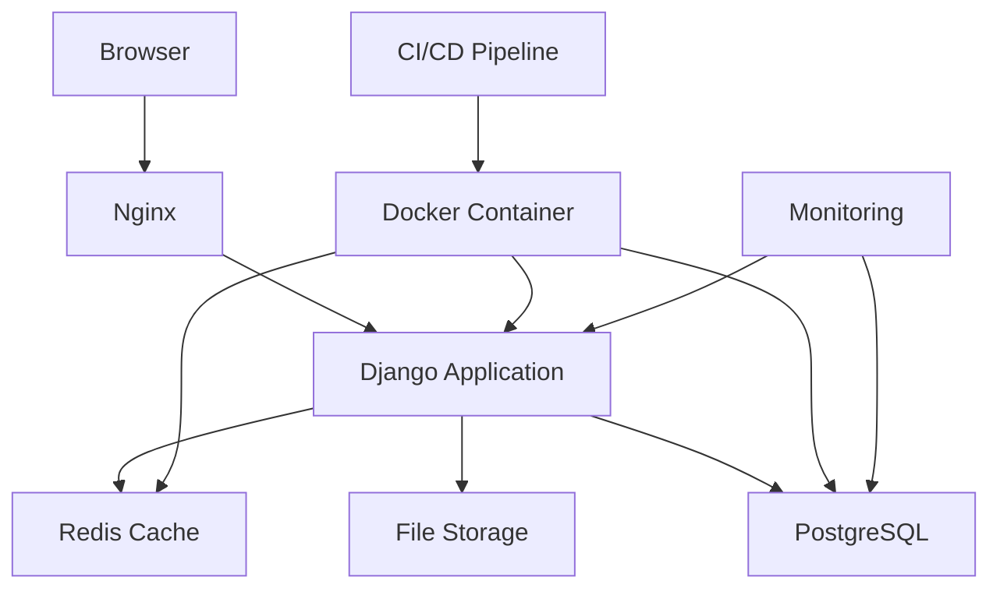
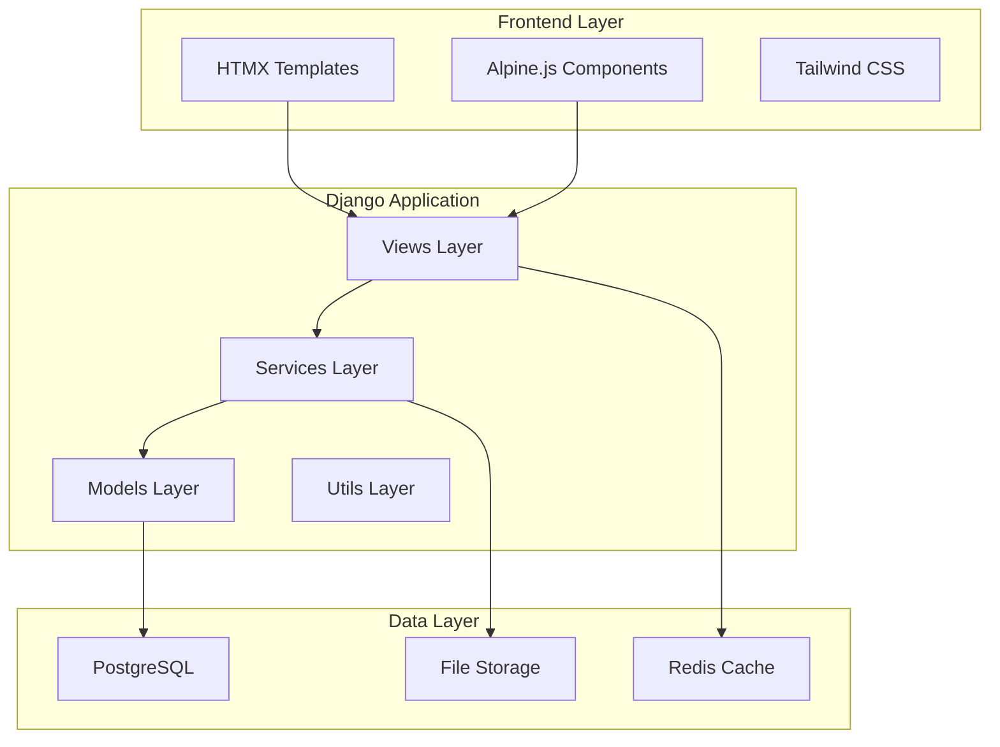

# Software Architecture Document
## Pass-Man Enterprise Password Management System

**Version**: 1.0  
**Date**: September 2025  
**Architecture**: Django + HTMX + Alpine + PostgreSQL  

---

## 🏗️ Architecture Overview

Pass-Man menggunakan modern web architecture dengan Django sebagai backend framework, HTMX untuk dynamic interactions, Alpine.js untuk client-side reactivity, dan PostgreSQL sebagai database. Seluruh sistem di-containerize dengan Docker untuk consistency dan portability.

### Architecture Principles
- **Security First**: Zero-trust architecture dengan encryption di setiap layer
- **Simplicity**: Minimal complexity untuk maintainability
- **Performance**: Optimized untuk fast response times
- **Scalability**: Horizontal scaling capability
- **Developer Experience**: Easy to develop, test, dan deploy

---

## 🎯 Technology Stack

### Backend Stack
- **Framework**: Django 5.x
- **API**: Django REST Framework (untuk API endpoints)
- **Authentication**: Django's built-in auth + JWT
- **Database ORM**: Django ORM dengan PostgreSQL
- **Encryption**: Python cryptography library
- **Task Queue**: Celery dengan Redis (future)

### Frontend Stack
- **Base**: Django Templates dengan HTMX
- **Interactivity**: Alpine.js untuk client-side logic
- **Styling**: Tailwind CSS + Shadcn components
- **Icons**: Heroicons atau Lucide icons
- **Build**: Django's static files handling

### Infrastructure Stack
- **Database**: PostgreSQL 15+
- **Cache**: Redis (untuk sessions dan caching)
- **Web Server**: Nginx (production)
- **WSGI**: Gunicorn
- **Containerization**: Docker + Docker Compose
- **CI/CD**: GitHub Actions atau GitLab CI

---

## 🏛️ System Architecture

### High-Level Architecture


### Application Architecture


---

## 📁 Project Structure

### Django Project Structure
```
pass_man/
├── manage.py
├── requirements.txt
├── docker-compose.yml
├── Dockerfile
├── .env.example
├── .gitignore
├── README.md
│
├── config/                     # Django settings
│   ├── __init__.py
│   ├── settings/
│   │   ├── __init__.py
│   │   ├── base.py
│   │   ├── development.py
│   │   ├── production.py
│   │   └── testing.py
│   ├── urls.py
│   ├── wsgi.py
│   └── asgi.py
│
├── apps/                       # Django applications
│   ├── __init__.py
│   ├── users/                  # User management
│   │   ├── __init__.py
│   │   ├── models.py
│   │   ├── views.py
│   │   ├── serializers.py
│   │   ├── services.py
│   │   ├── urls.py
│   │   ├── admin.py
│   │   ├── tests/
│   │   └── migrations/
│   │
│   ├── groups/                 # Group management
│   │   ├── __init__.py
│   │   ├── models.py
│   │   ├── views.py
│   │   ├── serializers.py
│   │   ├── services.py
│   │   ├── urls.py
│   │   ├── admin.py
│   │   ├── tests/
│   │   └── migrations/
│   │
│   ├── passwords/              # Password management
│   │   ├── __init__.py
│   │   ├── models.py
│   │   ├── views.py
│   │   ├── serializers.py
│   │   ├── services.py
│   │   ├── encryption.py
│   │   ├── urls.py
│   │   ├── admin.py
│   │   ├── tests/
│   │   └── migrations/
│   │
│   ├── directories/            # Directory management
│   │   ├── __init__.py
│   │   ├── models.py
│   │   ├── views.py
│   │   ├── serializers.py
│   │   ├── services.py
│   │   ├── urls.py
│   │   ├── admin.py
│   │   ├── tests/
│   │   └── migrations/
│   │
│   └── core/                   # Shared utilities
│       ├── __init__.py
│       ├── models.py           # Base models
│       ├── permissions.py      # Custom permissions
│       ├── mixins.py          # View mixins
│       ├── utils.py           # Utility functions
│       ├── exceptions.py      # Custom exceptions
│       └── validators.py      # Custom validators
│
├── templates/                  # Django templates
│   ├── base.html
│   ├── components/            # Reusable components
│   │   ├── navbar.html
│   │   ├── sidebar.html
│   │   ├── modal.html
│   │   └── forms/
│   ├── auth/                  # Authentication templates
│   │   ├── login.html
│   │   ├── register.html
│   │   └── password_reset.html
│   ├── dashboard/             # Dashboard templates
│   │   ├── index.html
│   │   └── components/
│   ├── groups/                # Group templates
│   │   ├── list.html
│   │   ├── detail.html
│   │   └── forms/
│   └── passwords/             # Password templates
│       ├── list.html
│       ├── detail.html
│       └── forms/
│
├── static/                    # Static files
│   ├── css/
│   │   ├── tailwind.css
│   │   └── custom.css
│   ├── js/
│   │   ├── alpine.js
│   │   ├── htmx.js
│   │   └── app.js
│   ├── images/
│   └── icons/
│
├── media/                     # User uploaded files
├── locale/                    # Internationalization
├── logs/                      # Application logs
└── tests/                     # Integration tests
    ├── __init__.py
    ├── test_integration.py
    └── fixtures/
```

---

## 🔧 Component Architecture

### 1. Models Layer (Data Models)

#### User Model
```python
# apps/users/models.py
from django.contrib.auth.models import AbstractUser
from django.db import models
import uuid

class User(AbstractUser):
    id = models.UUIDField(primary_key=True, default=uuid.uuid4)
    email = models.EmailField(unique=True)
    full_name = models.CharField(max_length=255)
    role = models.CharField(
        max_length=20,
        choices=[('USER', 'User'), ('SUPER_ADMIN', 'Super Admin')],
        default='USER'
    )
    active = models.BooleanField(default=True)
    banned = models.BooleanField(default=False)
    created_at = models.DateTimeField(auto_now_add=True)
    updated_at = models.DateTimeField(auto_now=True)
    last_login = models.DateTimeField(null=True, blank=True)
    
    USERNAME_FIELD = 'email'
    REQUIRED_FIELDS = ['full_name']
```

#### Group Model
```python
# apps/groups/models.py
from django.db import models
import uuid

class Group(models.Model):
    id = models.UUIDField(primary_key=True, default=uuid.uuid4)
    name = models.CharField(max_length=255)
    description = models.TextField(blank=True)
    owner = models.ForeignKey('users.User', on_delete=models.CASCADE, related_name='owned_groups')
    created_at = models.DateTimeField(auto_now_add=True)
    updated_at = models.DateTimeField(auto_now=True)
    
    class Meta:
        unique_together = ['name', 'owner']

class UserGroup(models.Model):
    ROLE_CHOICES = [
        ('MEMBER', 'Member'),
        ('ADMIN', 'Admin'),
    ]
    
    id = models.UUIDField(primary_key=True, default=uuid.uuid4)
    user = models.ForeignKey('users.User', on_delete=models.CASCADE)
    group = models.ForeignKey(Group, on_delete=models.CASCADE)
    role = models.CharField(max_length=10, choices=ROLE_CHOICES, default='MEMBER')
    joined_at = models.DateTimeField(auto_now_add=True)
    
    class Meta:
        unique_together = ['user', 'group']
```

#### Password Model
```python
# apps/passwords/models.py
from django.db import models
import uuid

class Password(models.Model):
    id = models.UUIDField(primary_key=True, default=uuid.uuid4)
    title = models.CharField(max_length=255)
    username = models.CharField(max_length=255, blank=True)
    password_encrypted = models.TextField()
    url = models.URLField(blank=True)
    notes_encrypted = models.TextField(blank=True)
    tags = models.JSONField(default=list)
    custom_fields = models.JSONField(default=list)
    favorite = models.BooleanField(default=False)
    
    directory = models.ForeignKey('directories.Directory', on_delete=models.CASCADE, null=True, blank=True)
    group = models.ForeignKey('groups.Group', on_delete=models.CASCADE)
    created_by = models.ForeignKey('users.User', on_delete=models.CASCADE)
    
    created_at = models.DateTimeField(auto_now_add=True)
    updated_at = models.DateTimeField(auto_now=True)
    last_accessed = models.DateTimeField(null=True, blank=True)
    
    class Meta:
        ordering = ['-updated_at']
```

### 2. Services Layer (Business Logic)

#### Password Service
```python
# apps/passwords/services.py
from cryptography.fernet import Fernet
from django.conf import settings
import base64
import hashlib

class PasswordEncryptionService:
    @staticmethod
    def generate_key(group_id: str) -> bytes:
        """Generate encryption key based on group ID"""
        key_material = f"{settings.SECRET_KEY}:{group_id}".encode()
        key = hashlib.sha256(key_material).digest()
        return base64.urlsafe_b64encode(key)
    
    @staticmethod
    def encrypt_password(password: str, group_id: str) -> str:
        """Encrypt password using group-specific key"""
        key = PasswordEncryptionService.generate_key(group_id)
        fernet = Fernet(key)
        encrypted = fernet.encrypt(password.encode())
        return base64.urlsafe_b64encode(encrypted).decode()
    
    @staticmethod
    def decrypt_password(encrypted_password: str, group_id: str) -> str:
        """Decrypt password using group-specific key"""
        key = PasswordEncryptionService.generate_key(group_id)
        fernet = Fernet(key)
        encrypted_bytes = base64.urlsafe_b64decode(encrypted_password.encode())
        decrypted = fernet.decrypt(encrypted_bytes)
        return decrypted.decode()

class PasswordService:
    @staticmethod
    def create_password(user, group, data):
        """Create new password entry"""
        encrypted_password = PasswordEncryptionService.encrypt_password(
            data['password'], str(group.id)
        )
        
        password = Password.objects.create(
            title=data['title'],
            username=data.get('username', ''),
            password_encrypted=encrypted_password,
            url=data.get('url', ''),
            notes_encrypted=PasswordEncryptionService.encrypt_password(
                data.get('notes', ''), str(group.id)
            ) if data.get('notes') else '',
            tags=data.get('tags', []),
            custom_fields=data.get('custom_fields', []),
            group=group,
            created_by=user,
            directory_id=data.get('directory_id')
        )
        return password
    
    @staticmethod
    def get_decrypted_password(password_obj):
        """Get password with decrypted fields"""
        decrypted_password = PasswordEncryptionService.decrypt_password(
            password_obj.password_encrypted, str(password_obj.group.id)
        )
        
        decrypted_notes = ''
        if password_obj.notes_encrypted:
            decrypted_notes = PasswordEncryptionService.decrypt_password(
                password_obj.notes_encrypted, str(password_obj.group.id)
            )
        
        return {
            'id': password_obj.id,
            'title': password_obj.title,
            'username': password_obj.username,
            'password': decrypted_password,
            'url': password_obj.url,
            'notes': decrypted_notes,
            'tags': password_obj.tags,
            'custom_fields': password_obj.custom_fields,
            'favorite': password_obj.favorite,
            'created_at': password_obj.created_at,
            'updated_at': password_obj.updated_at,
        }
```

### 3. Views Layer (Request Handling)

#### HTMX-Based Views
```python
# apps/passwords/views.py
from django.shortcuts import render, get_object_or_404
from django.contrib.auth.decorators import login_required
from django.http import JsonResponse
from django.views.decorators.http import require_http_methods
from .services import PasswordService
from .models import Password

@login_required
def password_list(request, group_id):
    """List passwords in a group"""
    group = get_object_or_404(Group, id=group_id)
    
    # Check user permission
    if not group.has_member(request.user):
        return render(request, 'errors/403.html', status=403)
    
    passwords = Password.objects.filter(group=group)
    
    # Handle search
    search_query = request.GET.get('search', '')
    if search_query:
        passwords = passwords.filter(
            models.Q(title__icontains=search_query) |
            models.Q(username__icontains=search_query) |
            models.Q(url__icontains=search_query)
        )
    
    context = {
        'group': group,
        'passwords': passwords,
        'search_query': search_query,
    }
    
    # Return partial template for HTMX requests
    if request.headers.get('HX-Request'):
        return render(request, 'passwords/partials/password_list.html', context)
    
    return render(request, 'passwords/list.html', context)

@login_required
@require_http_methods(["POST"])
def create_password(request, group_id):
    """Create new password via HTMX"""
    group = get_object_or_404(Group, id=group_id)
    
    if not group.has_member(request.user):
        return JsonResponse({'error': 'Permission denied'}, status=403)
    
    try:
        password = PasswordService.create_password(
            user=request.user,
            group=group,
            data=request.POST
        )
        
        # Return success response for HTMX
        return render(request, 'passwords/partials/password_item.html', {
            'password': password,
            'group': group
        })
        
    except Exception as e:
        return JsonResponse({'error': str(e)}, status=400)
```

### 4. Frontend Architecture

#### HTMX Integration
```html
<!-- templates/passwords/list.html -->
<div class="password-container">
    <!-- Search Form -->
    <form hx-get="" 
          hx-target="#password-list" 
          hx-trigger="input changed delay:300ms from:#search-input">
        <input type="text" 
               id="search-input" 
               name="search" 
               placeholder="Search passwords..."
               value="{{ search_query }}"
               class="w-full px-4 py-2 border rounded-lg">
    </form>
    
    <!-- Password List -->
    <div id="password-list" class="mt-4">
        
    </div>
    
    <!-- Create Password Modal -->
    <div x-data="{ open: false }">
        <button @click="open = true" 
                class="btn btn-primary">
            Add Password
        </button>
        
        <div x-show="open" 
             x-transition 
             class="modal">
            <form hx-post=""
                  hx-target="#password-list"
                  hx-swap="afterbegin"
                  @htmx:after-request="open = false">
                <!-- Form fields -->
            </form>
        </div>
    </div>
</div>
```

#### Alpine.js Components
```html
<!-- templates/components/password_item.html -->
<div x-data="passwordItem()" class="password-item">
    <div class="flex items-center justify-between p-4 border rounded-lg">
        <div class="flex-1">
            <h3 class="font-semibold">{{ password.title }}</h3>
            <p class="text-gray-600">{{ password.username }}</p>
        </div>
        
        <div class="flex space-x-2">
            <!-- Copy Password Button -->
            <button @click="copyPassword('{{ password.id }}')"
                    class="btn btn-sm btn-outline">
                <span x-show="!copied">Copy</span>
                <span x-show="copied" x-transition>Copied!</span>
            </button>
            
            <!-- Toggle Favorite -->
            <button @click="toggleFavorite('{{ password.id }}')"
                    :class="favorite ? 'text-yellow-500' : 'text-gray-400'"
                    class="btn btn-sm">
                ★
            </button>
        </div>
    </div>
</div>

<script>
function passwordItem() {
    return {
        copied: false,
        favorite: {{ password.favorite|yesno:"true,false" }},
        
        copyPassword(passwordId) {
            // HTMX request to get decrypted password
            htmx.ajax('GET', `/api/passwords/${passwordId}/decrypt/`, {
                target: 'body',
                swap: 'none'
            }).then(response => {
                navigator.clipboard.writeText(response.password);
                this.copied = true;
                setTimeout(() => this.copied = false, 2000);
            });
        },
        
        toggleFavorite(passwordId) {
            htmx.ajax('POST', `/api/passwords/${passwordId}/favorite/`, {
                target: 'body',
                swap: 'none'
            }).then(() => {
                this.favorite = !this.favorite;
            });
        }
    }
}
</script>
```

---

## 🔒 Security Architecture

### Encryption Strategy
```python
# apps/core/encryption.py
from cryptography.fernet import Fernet
from cryptography.hazmat.primitives import hashes
from cryptography.hazmat.primitives.kdf.pbkdf2 import PBKDF2HMAC
import base64
import os

class EncryptionManager:
    @staticmethod
    def derive_key(password: str, salt: bytes) -> bytes:
        """Derive encryption key from password and salt"""
        kdf = PBKDF2HMAC(
            algorithm=hashes.SHA256(),
            length=32,
            salt=salt,
            iterations=100000,
        )
        key = base64.urlsafe_b64encode(kdf.derive(password.encode()))
        return key
    
    @staticmethod
    def encrypt_data(data: str, key: bytes) -> str:
        """Encrypt data using Fernet symmetric encryption"""
        fernet = Fernet(key)
        encrypted = fernet.encrypt(data.encode())
        return base64.urlsafe_b64encode(encrypted).decode()
    
    @staticmethod
    def decrypt_data(encrypted_data: str, key: bytes) -> str:
        """Decrypt data using Fernet symmetric encryption"""
        fernet = Fernet(key)
        encrypted_bytes = base64.urlsafe_b64decode(encrypted_data.encode())
        decrypted = fernet.decrypt(encrypted_bytes)
        return decrypted.decode()
```

### Authentication & Authorization
```python
# apps/core/permissions.py
from rest_framework.permissions import BasePermission

class IsGroupMember(BasePermission):
    """Permission to check if user is member of the group"""
    
    def has_object_permission(self, request, view, obj):
        if hasattr(obj, 'group'):
            return obj.group.has_member(request.user)
        return False

class IsGroupOwnerOrAdmin(BasePermission):
    """Permission for group owners and admins"""
    
    def has_object_permission(self, request, view, obj):
        if hasattr(obj, 'group'):
            return obj.group.is_owner_or_admin(request.user)
        return False
```

---

## 🚀 Deployment Architecture

### Docker Configuration
```dockerfile
# Dockerfile
FROM python:3.11-slim

WORKDIR /app

# Install system dependencies
RUN apt-get update && apt-get install -y \
    postgresql-client \
    && rm -rf /var/lib/apt/lists/*

# Install Python dependencies
COPY requirements.txt .
RUN pip install --no-cache-dir -r requirements.txt

# Copy application code
COPY . .

# Collect static files
RUN python manage.py collectstatic --noinput

# Run migrations and start server
CMD ["gunicorn", "config.wsgi:application", "--bind", "0.0.0.0:8000"]
```

### Docker Compose
```yaml
# docker-compose.yml
version: '3.8'

services:
  web:
    build: .
    ports:
      - "8000:8000"
    environment:
      - DEBUG=False
      - DATABASE_URL=postgresql://user:password@db:5432/passmandb
      - REDIS_URL=redis://redis:6379/0
    depends_on:
      - db
      - redis
    volumes:
      - ./media:/app/media
      - ./logs:/app/logs

  db:
    image: postgres:15
    environment:
      - POSTGRES_DB=passmandb
      - POSTGRES_USER=user
      - POSTGRES_PASSWORD=password
    volumes:
      - postgres_data:/var/lib/postgresql/data
      - ./backups:/backups

  redis:
    image: redis:7-alpine
    volumes:
      - redis_data:/data

  nginx:
    image: nginx:alpine
    ports:
      - "80:80"
      - "443:443"
    volumes:
      - ./nginx.conf:/etc/nginx/nginx.conf
      - ./ssl:/etc/nginx/ssl
      - ./static:/app/static
    depends_on:
      - web

volumes:
  postgres_data:
  redis_data:
```

---

## 📊 Performance Considerations

### Database Optimization
```python
# Database indexes for performance
class Password(models.Model):
    # ... fields ...
    
    class Meta:
        indexes = [
            models.Index(fields=['group', '-updated_at']),
            models.Index(fields=['created_by', '-created_at']),
            models.Index(fields=['group', 'favorite']),
            models.Index(fields=['title']),  # For search
        ]
```

### Caching Strategy
```python
# apps/core/cache.py
from django.core.cache import cache
from django.conf import settings

class CacheManager:
    @staticmethod
    def get_user_groups(user_id):
        cache_key = f"user_groups:{user_id}"
        groups = cache.get(cache_key)
        
        if groups is None:
            groups = list(Group.objects.filter(
                models.Q(owner_id=user_id) |
                models.Q(usergroup__user_id=user_id)
            ).distinct())
            cache.set(cache_key, groups, timeout=300)  # 5 minutes
        
        return groups
    
    @staticmethod
    def invalidate_user_groups(user_id):
        cache_key = f"user_groups:{user_id}"
        cache.delete(cache_key)
```

---

## 🧪 Testing Architecture

### Test Structure
```python
# tests/test_password_service.py
import pytest
from django.test import TestCase
from apps.passwords.services import PasswordService, PasswordEncryptionService
from apps.users.models import User
from apps.groups.models import Group

class PasswordServiceTest(TestCase):
    def setUp(self):
        self.user = User.objects.create_user(
            email='test@example.com',
            password='testpass123',
            full_name='Test User'
        )
        self.group = Group.objects.create(
            name='Test Group',
            owner=self.user
        )
    
    def test_password_encryption_decryption(self):
        """Test password encryption and decryption"""
        original_password = "super_secret_password"
        group_id = str(self.group.id)
        
        # Encrypt
        encrypted = PasswordEncryptionService.encrypt_password(
            original_password, group_id
        )
        
        # Decrypt
        decrypted = PasswordEncryptionService.decrypt_password(
            encrypted, group_id
        )
        
        self.assertEqual(original_password, decrypted)
    
    def test_create_password(self):
        """Test password creation"""
        password_data = {
            'title': 'Test Password',
            'username': 'testuser',
            'password': 'secret123',
            'url': 'https://example.com',
            'notes': 'Test notes'
        }
        
        password = PasswordService.create_password(
            self.user, self.group, password_data
        )
        
        self.assertEqual(password.title, 'Test Password')
        self.assertEqual(password.group, self.group)
        self.assertEqual(password.created_by, self.user)
```

---

## 📈 Monitoring & Observability

### Logging Configuration
```python
# config/settings/base.py
LOGGING = {
    'version': 1,
    'disable_existing_loggers': False,
    'formatters': {
        'verbose': {
            'format': '{levelname} {asctime} {module} {process:d} {thread:d} {message}',
            'style': '{',
        },
    },
    'handlers': {
        'file': {
            'level': 'INFO',
            'class': 'logging.FileHandler',
            'filename': 'logs/django.log',
            'formatter': 'verbose',
        },
        'security': {
            'level': 'WARNING',
            'class': 'logging.FileHandler',
            'filename': 'logs/security.log',
            'formatter': 'verbose',
        },
    },
    'loggers': {
        'django': {
            'handlers': ['file'],
            'level': 'INFO',
            'propagate': True,
        },
        'apps.passwords': {
            'handlers': ['file', 'security'],
            'level': 'INFO',
            'propagate': True,
        },
    },
}
```

---

## 🔄 Development Workflow

### Local Development Setup
```bash
# 1. Clone repository
git clone <repository-url>
cd pass-man

# 2. Setup environment
cp .env.example .env
# Edit .env with local settings

# 3. Build and run with Docker
docker-compose -f docker-compose.dev.yml up --build

# 4. Run migrations
docker-compose exec web python manage.py migrate

# 5. Create superuser
docker-compose exec web python manage.py createsuperuser

# 6. Access application
# http://localhost:8000
```

### CI/CD Pipeline
```yaml
# .github/workflows/ci.yml
name: CI/CD Pipeline

on:
  push:
    branches: [ main, develop ]
  pull_request:
    branches: [ main ]

jobs:
  test:
    runs-on: ubuntu-latest
    
    services:
      postgres:
        image: postgres:15
        env:
          POSTGRES_PASSWORD: postgres
        options: >-
          --health-cmd pg_isready
          --health-interval 10s
          --health-timeout 5s
          --health-retries 5
    
    steps:
    - uses: actions/checkout@v3
    
    - name: Set up Python
      uses: actions/setup-python@v4
      with:
        python-version: '3.11'
    
    - name: Install dependencies
      run: |
        pip install -r requirements.txt
    
    - name: Run tests
      run: |
        python manage.py test
        
    - name: Run security checks
      run: |
        bandit -r apps/
        
    - name: Build Docker image
      run: |
        docker build -t pass-man:${{ github.sha }} .
```

---

*This architecture document provides the foundation for implementing Pass-Man dengan modern, secure, dan scalable approach menggunakan Django + HTMX + Alpine.js stack.*